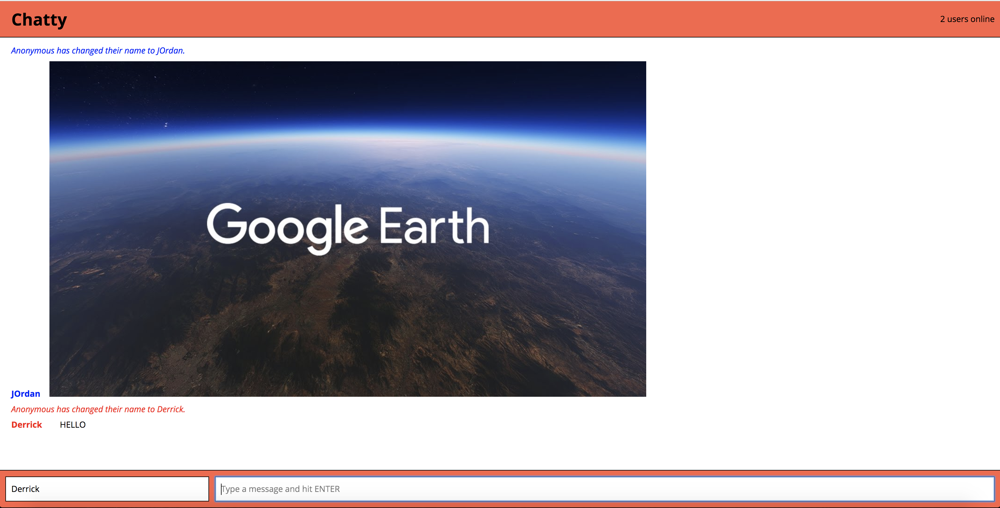

# Chatty App Project

Chatty App is a single page, client-side app built with ReactJS, WebSockets, Webpack, Babel, & Node.js. It creates a socket per user and each client is stored in the server which then allows the users to connect together. Multiple users can then join and communicate with everyone in "almost" real time.

## Getting Started

1. Clone this repo to your local machine.
2. Install dependencies using `npm install` command in the project's folder. You can run `npm start` now and the app will be served at <http:localhost:3000/>.
3. `cd chatty-server` and run `npm install`. Start the server with `node server.js`.
4. Go to <http:localhost:3000/> in your browser.

## Dependencies

#### Client Dependencies
- babel-core: 6.23.1,
- babel-loader: 6.3.1,
- babel-preset-es2015: 6.22.0,
- babel-preset-react: 6.23.0,
- babel-preset-stage-0: 6.22.0,
- css-loader: 0.26.1,
- eslint: 3.15.0,
- eslint-plugin-react: 6.9.0,
- node-sass: 4.5.0,
- sass-loaderu: 6.0.0,
- sockjs-client: ^1.1.2,
- style-loader: 0.13.1,
- webpack: 2.2.1,
- webpack-dev-server: 2.3.0
- react: 15.4.2,
- react-dom: 15.4.2

#### Server Dependencies
- express: 4.16.3,
- uuid: ^3.2.1,
- ws: 5.2.0

## Screenshot
